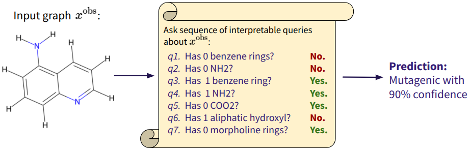
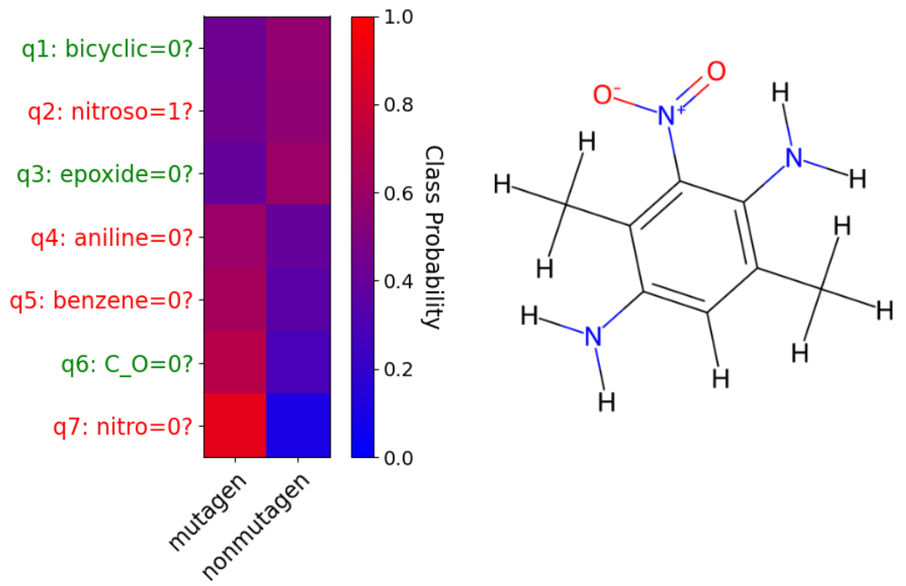

# Interpretable Predictions for Graph Classification using Variational Information Pursuit
**Andrei Vlad Dome**<br>
**`andreivlad.dome@gmail.com`**

<p align="center">

</p>

This repo accompanies a research paper I wrote in my final semester at McMaster University, completed while visiting Ludwig Maximilian University of Munich, Chair for Mathematical Foundations of AI. The paper can be found in the repo as `graph_vip_dome_2025.pdf`. Please read for more detailed info about the project. For any questions/inquiries, please email me at `andreivlad.dome@gmail.com`!

Most of this work is based on the ICLR 2023 paper [*Variational Information Pursuit for Interpretable Predictions*](https://arxiv.org/abs/2302.02876) (Chattopadhyay et al. 2023). My repo was originally a fork of the associated repo for their paper, [ryanchankh/VariationalInformationPursuit](https://github.com/ryanchankh/VariationalInformationPursuit), and I turned it into a standalone repo, building off of their previous code.

## My Code Contributions:

- Creating a data pipeline for automatically cleaning and converting the raw [Mutagenicity](https://chrsmrrs.github.io/datasets/docs/datasets/) dataset into [NetworkX](https://networkx.org/) graph objects and [RDKit](https://rdkit.org/) molecule objects.
- Automatically generating a node-induced subgraph enumeration-based query set for training V-IP on the Mutagenicity dataset, using [`RDKit.Chem.Fragments`](https://rdkit.org/docs/source/rdkit.Chem.Fragments.html) module functions to enumerate functional groups in molecules.
- Python scripts to train a V-IP querier and classifier on the Mutagenicity dataset, including a script for a 10-fold cross validation train/test run of V-IP.
- An `example_usage.ipynb` notebook for visualizing V-IP's sequence of queries and answers with associated predictions for a user-defined molecule. 

## Research Paper Overview

Graph Neural Networks (GNNs) have become ubiquitous for graph classification tasks. Although, their high accuracy comes with a sacrifice in interpretability, which is a pitfall in cases where transparency about a model’s decision-making process is important, such as when employed for scientific discovery purposes or in high-risk scenarios. Post-hoc explainability methods can be used to explain a black-box model’s internal reasoning, but may not always be reliable. As a result, models that are ”interpretable-by-design” have emerged. One such method is Variational Information Pursuit (V-IP), which is a neural network-based method that sequentially asks user-interpretable, task-relevant queries about data until a prediction can be made with some sufficient level of confidence, resulting in a sequence of queries and answers that provide full transparency about the model’s decision-making process *(See Figures Above)*. We propose a framework for creating induced subgraph enumeration-based query sets for V-IP, in order to produce interpretable predictions for graph classification tasks. We demonstrate the efficacy of this framework by crafting a domain-specific query set for a graph classification task from chemistry, mutagen classification, and show that V-IP achieves test accuracies that beat those of black-box GNNs and another neural network-based interpretable-by-design model. Finally, we qualitatively show how V-IP’s explanations provide valuable insight into how certain functional groups (specific subgraphs) of a molecule play a role in it being classified as mutagenic or not, paving the way for future domain-centric research in Explainable AI for mutagen classification and other graph-based tasks.

## Example Usage & Pre-trained Model

Checkpoint to an example **pre-trained model** can be downloaded from [here](https://huggingface.co/vladnotandrei/mutagen-classification-variational-information-pursuit/blob/main/example_model.ckpt) as a file called `example_model.ckpt`. A jupyter notebook named `example_usage.ipynb` with checkpoint loading instructions for the Mutagenicity dataset is located in the project's root folder. Run it as is to visualize V-IP's sequence of queries and answers with associated predictions for an example molecule *(as seen below)*, or define your own molecule.

The example model is trained on all of the Mutagenicity dataset, using the exact same hyperparameters used to obtain the results in the paper for the 10-fold cross validation on the Mutagenicity dataset.

<p align="center">

</p>

## Setup Instructions

This project uses a Conda environment for reproducibility.

### 1. Clone repo

```
git clone https://github.com/vladnotandrei/vip-interpretable-graph-classification.git
cd vip-interpretable-graph-classification
```

### 2. Create Conda environment

```
conda env create -f environment.yml
conda activate vip_graphs
```

### 3. Use the Conda environment in Jupyter notebooks

```
python -m ipykernel install --user --name=vip_graphs --display-name "Python (vip_graphs)"
```

### NOTE:
`wandb` (Weights and Biases) is used to track training and testing performance. One may remove lines related to `wandb` and switch to other packages if they desire.

## Generating User-Defined Query Set
Before training the model, you must generate the queryset by running:

```
python3 generate_queryset.py \
  --dataset_root ./data/Mutagenicity \
  --save_dir  <SAVE_DIR>
```

where `<SAVE_DIR>` is the directory you wish to save the generated queryset, which will be saved as `rdkit_queryset.csv`.

The names of the functional groups in the queries are directly taken from the official documentation for the `rdkit.Chem.Fragments` module. Please refer to it at this [link](https://rdkit.org/docs/source/rdkit.Chem.Fragments.html) for more information about the functional groups used in the queryset.

## Training/Testing Mutagenicity
There are two stages of training: *Initial Random Sampling (IRS)* and *Subsequent Adaptive Sampling (SAS)*.

First, run IRS:

```
python3 train_mutagenicity.py \
  --epochs 100 \
  --batch_size 128 \
  --queryset_size 407 \
  --max_queries 407 \
  --max_queries_test 20 \
  --threshold 0.85 \
  --lr 0.0001 \
  --tau_start 1.0 \
  --tau_end 0.2 \
  --sampling random \
  --seed 0 \
  --name mutagenicity_random \
  --mode online \
  --save_dir <SAVE_DIR> \
  --data_dir <DATA_DIR>/Mutagenicity \
  --query_dir <QUERY_DIR>/rdkit_queryset.csv
```

Afterwards, run SAS:

```
python3 train_mutagenicity.py \
  --epochs 100 \
  --batch_size 128 \
  --queryset_size 407 \
  --max_queries 407 \
  --max_queries_test 20 \
  --threshold 0.85 \
  --lr 0.0001 \
  --tau_start 1.0 \
  --tau_end 0.2 \
  --sampling biased \
  --seed 0 \
  --name mutagenicity_biased \
  --mode online \
  --save_dir <SAVE_DIR> \
  --data_dir <DATA_DIR>/Mutagenicity \
  --query_dir <QUERY_DIR>/rdkit_queryset.csv
  --ckpt_path <CKPT_PATH>
```

where,
- `<SAVE_DIR>` is the folder to save model checkpoints during training
- `<DATA_DIR>` is the directory containing the raw Mutagenicity dataset folder
- `<QUERY_DIR>` is the folder containing the previously generated queryset as a CSV file
- `<CKPT_PATH>` is the path to the pre-trained model using IRS, as a `.ckpt` file.

One can play around with the hyperparameters. Please refer to my research paper for hyperparameters used for certain experiments.

Code for performing a 10-fold Cross Validation, as is done in the research paper, is located in `train_mutagenicity_cv.py` and can be run using similar command line arguments as above, with additional arguments related to saving model checkpoints in a cross-validation loop. A single training run can be performed by running `train_mutagenicity.py` with command-line arguments as shown above.

## Reproduce Paper Results

To reproduce the results of the 10-fold cross validation, run:

```
python3 train_mutagenicity_cv.py \
  --epochs 500 \
  --batch_size 128 \
  --queryset_size 407 \
  --max_queries 407 \
  --max_queries_test 20 \
  --threshold 0.85 \
  --lr 0.0001 \
  --tau_start 1.0 \
  --tau_end 0.2 \
  --seed 0 \
  --name reproduce_paper_10fold_cv \
  --mode online \
  --save_dir <SAVE_DIR> \
  --data_dir <DATA_DIR>/Mutagenicity \
  --query_dir <QUERY_DIR>/rdkit_queryset.csv \
```

This took ~8h to run on my machine with CUDA enabled. See paper *Section 5.2: V-IP Training Setup* in paper for details.